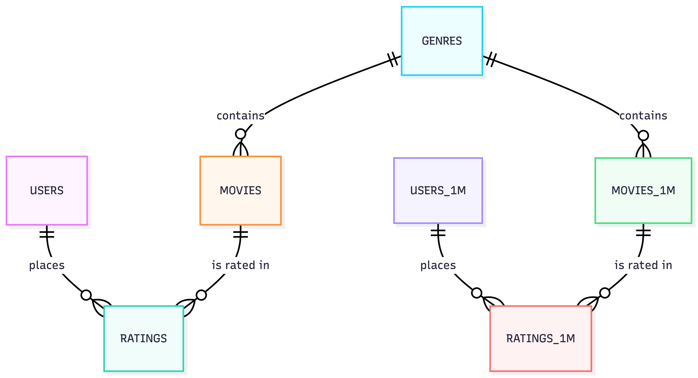

# DS 4320 Project 1: Breaking the Filter Bubble, A Diversity-Aware Movie Recommendation System

## Executive Summary

This repository contains materials necessary for running DS 4320 Project 1. The project addresses the problem of filter bubbles in content recommendation systems, which is the tendency of algorithms to progressively narrow the diversity of content shown to users over repeated recommendation cycles. Using both the MovieLens 100K and MovieLens 1M datasets, the project builds a seven-table relational database (ratings, movies, users, genres, ratings_1m, movies_1m, users_1m), implements a user based collaborative filtering recommender system in Python with DuckDB for data management, evaluates a MMR diversity of re-ranking layer that measurably reduces filter bubble formation while preserving recommendation quality. The pipeline shows that a lightweight post processing diversity intervention can reduce content narrowing without rebuilding the underlying algorithm from scratch.

**Name:** Yuthi Madireddy

**Computing ID:** hva4zb

**DOI:**

**License:** MIT — see [LICENSE](./LICENSE)

------------------------------------------------------------------------

## Links:

**Data (One_Drive Link):** [UVA - One Drive Data Location](https://myuva-my.sharepoint.com/:f:/g/personal/hva4zb_virginia_edu/IgAsZDhl7hqQSoWNQmeGtv3FAWr_7hC05cuXCIxHAml5Bdc?e=mUTqge)

**Data (Github Link)**: [data/](./data/)

**Pipeline:** [pipeline/pipeline.ipynb](./pipeline/pipeline.ipynb)

**Press Release:** [press_release.md](./press_release.md)

**Background Reading:** [background_reading/](./background_reading/)

## Problem Definition:

**General Problem:** Recommending Content (e.g. Netflix)

**Refined Specific Problem Statement:** Using the MovieLens 100K dataset, this project is specifically focused on how 'strong' the filtering recommendation algorithms reduce content diversity over repeated recommendation cycles, and evaluates whether a simple MMR re-ranking layer could measurably slow down the filter bubble formation by offering a few diverse choices here.

**Rationale for Refinement** The main concern or point of issue, is how recommending algorithms are extremely pervasive and are optimized purely for engagement. Consequently, feedback loops are created where users are repeatedly shown content which already affirms their beliefs and views which narrows down the amount of diverse information they see. Rather than attempting to fully rebuild recommendation systems from scratch, this project aims to simply re-rank each algorithm's output list and reorder it to ensure there is a minimum level of genre diversity per recommendation cycle. The main scope is to simulate filter bubble formation over repeated cycles and test whether re-ranking slows down the reduction of content diversity.

**Motivation:** Recommendation algorithms decide what media billions of people watch, read, and engage with everyday. When these systems are designed for short term engagement optimization rather than informational material, the downstream effects have already been recorded: increased political polarization, susceptibility to misinformation, and echo chambers. The scale of this problem makes data driven tools helpful for measuring when and how these filter bubbles form, and under what conditions they can be interrupted which is a strong step towards designing healthier recommendation systems.

**Press Release Headline:**

[Breaking the Loop: A New Approach to Content Recommendation Tones Down the Filter Bubble WITHOUT Ruining Your Feed](./press_release.md)

------------------------------------------------------------------------

## Domain Exposition

### Terminology:

| Term / KPI | Definition |
|------------------------------------|------------------------------------|
| **Recommender System (RS)** | An algorithm that predicts items a user will find relevant based on past behavior, ratings, or user similarity. |
| **Collaborative Filtering (CF)** | A family of RS methods that generate recommendations based on the preferences of similar users (user-based) or similar items (item-based). |
| **Filter Bubble** | A state in which a user is algorithmically exposed only to content that aligns with prior preferences, limiting viewpoint diversity (Pariser, 2011). |
| **Echo Chamber** | A group-level phenomenon where people interact primarily with others who share their views, reinforcing existing beliefs. |
| **Intra-List Diversity (ILD)** | A metric measuring how dissimilar recommended items in a single list are from each other; higher ILD = more diverse. |
| **Re-ranking** | A post-processing step applied to a recommendation list that reorders items to improve a secondary objective (e.g., diversity). |
| **MMR (Maximal Marginal Relevance)** | A re-ranking algorithm that balances relevance and diversity by selecting items that are both relevant and dissimilar to already-selected items. |
| **Feedback Loop** | The cycle where a user's consumption of recommended items shapes future recommendations, potentially amplifying narrow preferences. |
| **NDCG** | Normalized Discounted Cumulative Gain — a standard metric for ranking quality that rewards relevant items appearing higher in the list. |
| **Accuracy-Diversity Trade-off** | The empirical tension between maximizing recommendation relevance and maintaining content diversity. |

### Domain Overview:

This project intersects with machine learning, social science, and information systems. Recommender systems are part of everyday life at this point, with every major company deploying it in some sense. Every major platform such as Netflix, TikTok, Spotify,etc. uses them to decide what content users see next. The main underlying mechanism is already understood, as the filtering computes recommendations based off the user's interactions and history. By doing so, the algorithm ranks unseen items by predicting their relevance. The societal problem has also been noted down in many papers, such as (Levy, 2021). With optimization for short term engagement (clicks, watch time, likes) prioritized, the creation of feedback loops progressively limit down on a narrow subset of a user's interests. At the sheer scale of social media's reach, millions of individual feedback loops can compound into measurable shifts in political polarization, media consumption patterns, and health behaviors.

### Background Reading

| \# | Title | Brief Description | Link |
|------------------|------------------|------------------|------------------|
| 1 | Trap of Social Media Algorithms: A Systematic Review on Filter Bubbles, Echo Chambers, and Their Impact on Youth (MDPI, 2025) | Reviews 30 studies (2015–2025) on how algorithms create ideological homogeneity; finds consistent evidence that algorithmic systems amplify selective exposure, especially for younger users. | [PDF](./background_readings/societies-15-00301.pdf) |
| 2 | Understanding Echo Chambers in Recommender Systems (IJACSA, 2025) | A systematic literature review on how collaborative filtering and content based systems mechanically produce echo chambers; surveys detection and mitigation methods. | [PDF](./background_readings/Paper_2-Understanding_Echo_Chambers_in_Recommender_Systems.pdf) |
| 3 | Filter Bubbles in Recommender Systems: Fact or Fallacy (arXiv, 2023) | Surveys the empirical literature and classifies studies by whether they found filter bubble evidence; identifies methodological causes of disagreement. | [PDF](./background_readings/3paper.pdf) |
| 4 | Understanding Echo Chambers and Filter Bubbles (MIS Quarterly / Darden UVA, 2020) | Empirical study using Twitter data examining the relative contribution of algorithmic filtering vs. user choice in producing filter bubbles. | [PDF](./background_readings/4KitchensJohnsonGray%20Final_0.pdf) |
| 5 | Algorithmic Domination in the Modern Republic (MDPI, 2025) | Examines how disinformation, echo chambers, and filter bubbles threaten democratic institutions, proposes platform regulation and media literacy interventions. | [PDF](./background_readings/5socsci-14-00391.pdf) |

------------------------------------------------------------------------

## Data Creation

### Provenance

The dataset is the MovieLens 1M Benchmark, which is collected and maintained by the GroupLens Research Lab at the University of Minnesota. The data was compiled from user activity on the MovieLens movie recommendation platform between September 1997 and April 1998, and released as a benchmark dataset in 1998. The dataset is free for public use at <https://grouplens.org/datasets/movielens/100k/>. The 1M genre data was stored as pipe-separated strings and parsed into the same 18 binary flag columns as the 100K movies table for cross-dataset consistency. The data was downloaded as a zip archive and then unizpped/extracted into seven .csv files across two datasets, representing a normalized relational schema.

### Code

| File | Description | Link |
|------------------------|------------------------|------------------------|
| `pipeline/pipeline.ipynb` | Loads all four CSVs into DuckDB, runs SQL queries to prepare the recommendation dataset, implements user-based collaborative filtering, applies MMR diversity re-ranking, computes ILD across recommendation cycles, trains a classification model, and visualizes results. | [pipeline.ipynb](./pipeline/pipeline.ipynb) |

### Bias Identification

The MovieLens datasets contains several important biases. The data was collected through a voluntary sampling design, meaning that we have selection bias. Those who volunteered to participate are likely to be more inclined towards cinema and movies in general, compared to a random individual selected. As a result, there is a skew away from casual viewers. Another bias to note is the demographic of our respondents. The large majority (71%) of users are male, and the age and occupation distributions are also not representative of the general population. Moreover, there is the issue of popularity bias which is the fact that well-known films have much more ratings than obscure ones, which makes the recommendation signal much stronger for a popular titles. Lastly, the temporal bias is that all the ratings were collected in a seven month window between 1997-1998, so the movie reviews are limited to the genre trends and cultural context from that single time period.

### Bias Mitigation:

Demographic bias can be partially addressed by stratifying our analysis by gender or age group to check if the diversity decay patterns differ across different user segments. Popularity bias can be mitigated by including long tail films in the candidate pool when generating recommendations rather than drawing only from the highest rated titles, which is directly relevant to the main goal of the project's diversity re-ranking goal. Temporal bias can not be avoided here since we are using a static dataset, meaning the dataset is not updated with additional records as time goes on. Instead, temporal bias is acknowledged as a main limitation for the project with our simulated filter bubble dynamics being described as illustrative simulations and not used to make claims about modern systems.

### Rationale for Critical Decisions

The choice of using the MovieLens 100K and the 1M datasets together was because both datasets provides a sufficient level of scale for collaborative filtering while remaining sizable enough for computations in a notebook environment.

The MovieLens files embed genre information as 19 binary flag columns directly on the movies table. Extracting genres into a separate lookup table (`genre.csv`) normalizes the schema to 3NF, eliminates redundancy, and allows SQL joins that are more expressive for genre based diversity queries.

The pre-split files (`u1.base`, `u1.test`) are designed for accuracy benchmarking. Since this project measures diversity dynamics rather than prediction accuracy, the full `u.data` file is used instead to maximize coverage of the user-item space.

The choice to exclude the `unknown` genre flag is done so because the flag is set to 1 for only 2 of the 1,682 movies. Since its a negligible amount of signal, it is dropped from the genre based similarity computations.

------------------------------------------------------------------------

## Metadata

### Schema: ER Diagram (Logical Level)

------------------------------------------------------------------------

### Data Table

| Table | Description | Link |
|------------------------|------------------------|------------------------|
| ratings | 100,000 explicit ratings (1–5 stars) from 943 users on 1,682 movies with Unix timestamps. (MovieLens 100K) | [ratings.csv](./data/ratings.csv) |
| movies | Metadata for 1,682 movies: title, release date, and 18 binary genre columns. (MovieLens 100K) | [movies.csv](./data/movies.csv) |
| users | Demographic data for 943 users: age, gender, occupation, zip code. (MovieLens 100K) | [users.csv](./data/users.csv) |
| genres | Shared lookup table mapping genreId to genreName for the 18 valid genres. | [genres.csv](./data/genres.csv) |
| ratings_1m | 1,000,209 explicit ratings (1–5 stars) from 6,040 users on 3,883 movies. (MovieLens 1M) | [ratings_1m.csv](./data/ratings_1m.csv) |
| movies_1m | Metadata for 3,883 movies with same 18 binary genre columns as movies table. (MovieLens 1M) | [movies_1m.csv](./data/movies_1m.csv) |
| users_1m | Demographic data for 6,040 users: gender, age, occupation, zip. (MovieLens 1M) | [users_1m.csv](./data/users_1m.csv) |

### Data Dictionary

**Ratings**

| Name      | Data Type | Description                         | Example     |
|-----------|-----------|-------------------------------------|-------------|
| userId    | INTEGER   | Unique user identifier (1–943)      | `196`       |
| movieId   | INTEGER   | Unique movie identifier (1–1682)    | `242`       |
| rating    | INTEGER   | Explicit star rating, scale 1–5     | `3`         |
| timestamp | INTEGER   | Unix timestamp of rating submission | `881250949` |

**Movies**

| Name | Data Type | Description | Example |
|------------------|------------------|------------------|------------------|
| movieId | INTEGER | Unique movie identifier, PK | `1` |
| title | TEXT | Movie title with release year | `Toy Story (1995)` |
| release_date | TEXT | Release date string | `01-Jan-1995` |
| Action…Western | INTEGER (binary) | 18 genre flag columns; 1 if movie belongs to genre | `1` or `0` |

**Users**

| Name | Data Type | Description | Example |
|----|----|----|----|
| userId | INTEGER | Unique user identifier, PK | `1` |
| age | INTEGER | User age in years (self-reported) | `24` |
| gender | TEXT | Self-reported gender: M or F | `M` |
| occupation | TEXT | Self-reported occupation category | `technician` |
| zip | TEXT | US zip code (text to preserve leading zeros) | `85711` |

**genres**

| Name      | Data Type | Description                         | Example  |
|-----------|-----------|-------------------------------------|----------|
| genreId   | INTEGER   | Numeric genre identifier (1–18), PK | `1`      |
| genreName | TEXT      | Human-readable genre label          | `Action` |

### Data Dictionary: Uncertainty Quantification

**Ratings Table**

| Feature | Min | Max | Mean | Std Dev | Median | Notes |
|-----------|-----------|-----------|-----------|-----------|-----------|-----------|
| userId | 1 | 943 | 462.5 | 266.6 | 447 | Identifier — no analytic uncertainty. |
| movieId | 1 | 1682 | 425.5 | 330.8 | 322 | Distribution skews toward lower IDs (more popular/older films receive more ratings). |
| rating | 1 | 5 | 3.53 | 1.13 | 4 | Ordinal; treated as continuous for modeling. Scale-use bias inflates mean — some users never rate below 3. |
| timestamp | 874724710 | 893286638 | 883528900 | 5.34×10⁶ | 882826900 | Unix seconds. Rating behavior is episodic (users rate in sessions), so timestamps are not independent. |

**Users Table**

| Feature | Min | Max | Mean | Std Dev | Median | Notes |
|-----------|-----------|-----------|-----------|-----------|-----------|-----------|
| age | 7 | 73 | 34.1 | 12.2 | 31 | Self-reported; not validated. Minimum of 7 raises data entry questions. |

**Genres Table**

| Feature | Notes |
|------------------------------------|------------------------------------|
| genreId | Integer identifier 1–18; deterministic mapping, no uncertainty. |
| genreName | String labels assigned by MovieLens curators. Genre boundary decisions are subjective (e.g., what separates Thriller from Horror) but consistent within the dataset. |