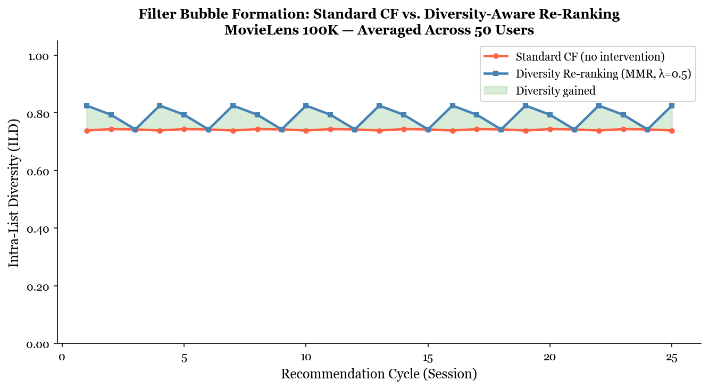

# Breaking the Loop: A New Approach to Content Recommendation Tones Down the Filter Bubble WITHOUT Ruining your Feed

## Hook:

It's Friday night and you sit down and open Netflix. Every title you see are all somewhat familiar, the same genre, vibe, and same story as the movie you watched last week and the week before. You open TikTok and start scrolling, only to see that every video seems to be the same as the last one you saved in your 'Favorites'. At some point without you noticing, the apps began showing you the same content over and over again. That echo chamber is also known as the filter bubble. and it's been building up one click at a time since you began consuming media on that platform.

## Problem Statement:

Every major streaming and social platform, such as Netflix, Tiktok, Youtube, Spotify, etc. uses a recommendation algorithm to decide what you see next. These systems are designed with the sole purpose of keeping you engaged for as long as possible. These algorithms learn your habits, tastes, preferences, and serve up content that matches them to a 't'. The problem is that the content that is not being recommended never gets a chance to be seen by you as the algorithm is actively preventing anything that doesn't match your interests. Every click, like, comment, etc. nudges the algorithm further in a specific direction. Over dozens of different user sessions, all those interactions lead to the algorithm to continue suggesting specific interests and causes the algorithm to stop recommending certain content. The scope of the content we consume begins to reduce down and it happens gradually, before most people start noticing.

When the content narrowing happens with news, politics, or health information, the consequences becomes far more real. People end up in informational worlds that do not overlap, making it harder to share a common understanding of what is actually occurring.

## Solution Description:

The project builds a simple additional layer that can sit on top of any standard recommendation engine and helps widen the mix of content it serves you WITHOUT fully disregarding recommendations you may want.

The main idea is instead of letting the algorithm serve you its top ten picks in order of predicted relevance, this tool will intercept that list and then reshuffle it so that the final set includes a healthy variety of different genres and styles. You still get to enjoy what you like, but there is still some variety included as well.

Using the MovieLens Dataset of over one million real movie ratings from nearly a 1000 different users, the project simulates what happens to a person's recommendation feed over 15 different viewing sessions under two main conditions. The first is where the algorithm runs unchecked, and one where diversity layer is active. The results show a clear and measurable difference, the diversity layer keeps the feed from narrowing nearly as fast, while still serving content that users actually rate highly. You get a better mix without sacrificing quality.

The end goal is to not fully diminish or disregard the recommendations algorithms provide. It's to ensure that the algorithm is not silently deciding for you to only watch one kind of thing.

## Chart

*The chart above shows Intra-List Diversity (ILD) - a measure of how varied your recommendation list is across 25 simulated viewing sessions. The red line shows diversity declining steadily under a standard recommendation algorithm. The blue line shows the same metric when the diversity re-ranking layer is active. The green shaded area represents the diversity you gain from the intervention. Across all sessions, the diversity layer consistently produces a more genre-varied feed than the unchecked algorithm.*